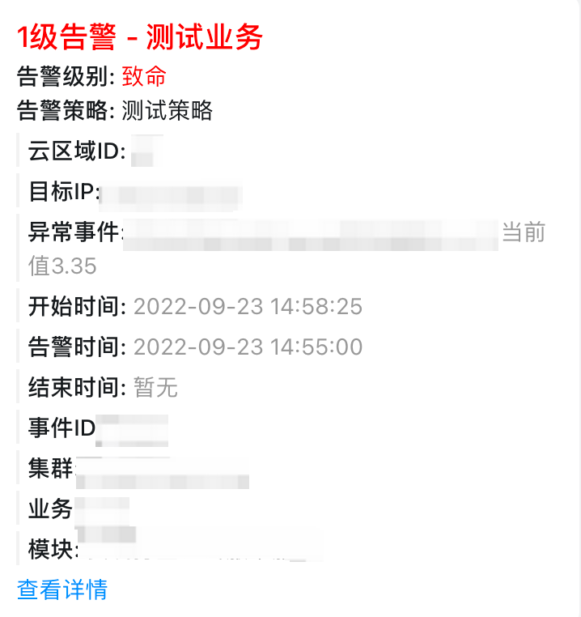

# 蓝鲸监控告警回调通知

## 1. 介绍

本项目用于蓝鲸告警配置回调通知

开发框架为:[go-zero](https://go-zero.dev/cn/)

当前支持： 钉钉机器人 、飞书机器人

## 2. 配置方法

### 飞书机器人:

飞书地址:

http://127.0.0.1:8887/api/notify/larkBot?key={飞书机器人key}&secret={签名secret}

添加机器人:

添加机器人后选择签名校验

飞书机器人key为webhook最后的一串uuid


飞书机器人secret为签名校验的secret


注意：默认会在告警时间加8小时如不需要添加则添加参数
&timeLocal=0

完整链接示意:

默认转换时区:

http://127.0.0.1:8887/api/notify/larkBot?key=06ddbd05-bc87-4c28-8230-6d0406ac3c67&secret=jbfG9PaiYHj02GOp

不转换时区:

http://127.0.0.1:8887/api/notify/larkBot?key=06ddbd05-bc87-4c28-8230-6d0406ac3c67&secret=jbfG9PaiYHj02GOp&timeLocal=0

飞书机器人效果:


### 钉钉机器人:

添加机器人:

获取机器人webhook地址拿到最后的token
链接示意https://oapi.dingtalk.com/robot/send?access_token=5165f0fb126694c6a15770c8029*********************f129e22

安全设置选择加签验证


钉钉地址:

http://127.0.0.1:8887/api/notify/dingTalkBot?key={钉钉机器人Token}&secret={钉钉签名secret}

钉钉机器人Token取webhook地址最后的access_token=后面的一串字符

完整链接示意:

http://127.0.0.1:8887/api/notify/dingTalkBot?key=asdadfqwe123as123&secret=test1234567654asd

转换时区参考上述飞书链接

钉钉展示效果:




## 3. config文件

```yaml
Name: notify
Host: 0.0.0.0
Port: 8887 # 启动端口
BkUrl:  # 平台链接用于展示
```

## 4. 蓝鲸配置方法


